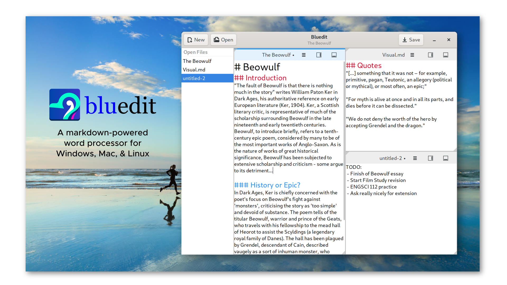

# Bluedit
Bluedit (pronounced 'blue-edit') is a word processor written in C and Gtk. I created it
for NCEA Level 3 Digital Technologies AS 91637 and it has been
iterated on and cleaned-up for public release. Enjoy :)



## Downloads
You can download Bluedit for Windows from the [releases page](https://github.com/mjakeman/bluedit/releases/).

## Project Structure
The source code for the program is in the `/src` subdirectory, while the code
for libsplit is in the `/subprojects/libsplit` directory. The program otherwise
follows the default GNOME application directory layout.

## Features
The main features of the program are:

 - Interactive markdown editor (with six levels of headings and bold/italic styles)
 - Splitting areas into any desirable combination
 - Joining areas by clicking and dragging from the corners
 - Opening and saving files
 - Saving as new files
 - Changing and configuring the font
 
## Running the Program
Bluedit has been designed to run on Windows and Linux. Windows binaries are available from the
releases page, whereas for Linux (and also MacOS), the program will need to be built
manually. Building instructions are as follows:

## Building
### Flatpak (Recommended for Linux)
The easiest way to build the program is to open it with GNOME Builder
and allow it to download the required SDKs for you. Alternatively, you
could build it directly with the flatpak command line tool:

```
# Build the flatpak
$ flatpak-builder flatpak-build com.mattjakeman.bluedit.json --force-clean --disable-cache

# Test the flatpak
$ flatpak-builder --run flatpak-build com.mattjakeman.bluedit.json bluedit

# Package in repo
$ flatpak-builder --repo=repo --force-clean flatpak-build com.mattjakeman.bluedit.json

# Add repo
$ flatpak --user remote-add --no-gpg-verify bluedit-repo repo

# Option 1: Install
$ flatpak --user install bluedit-repo com.mattjakeman.bluedit

# Option 2: Update
$ flatpak update com.mattjakeman.bluedit

# Run
$ flatpak run com.mattjakeman.bluedit

```

### Meson
Building with meson can be done as follows. This requires that the
following dependencies are installed:
 - gtk3
 - cmark (latest release)
 - cmake

```
$ meson build
$ ninja -C build
```
